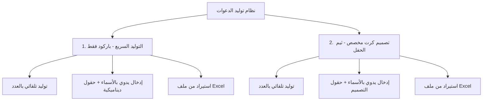

# 📨 دليل نظام إصدار وتوليد الدعوات الإلكترونية الذكية

مرحباً بك! يهدف هذا الدليل إلى شرح **نظام إصدار بطاقات الدعوة والباركود** بشكل مبسط ومحترف، ليوضح لك كافة الطرق والخيارات المتاحة لإنشاء وتوليد البطاقات لضيوفك بكل سهولة، دون الحاجة لأي خلفية تقنية أو برمجية.

---

## 🌟 الفلسفة العامة للنظام
تم تصميم النظام ليعطيك **المرونة المطلقة** في إدارة حفلتك أو مؤتمرك. سواء كنت ترغب في إصدار بطاقات سريعة جداً تحتوي فقط على رمز الاستجابة السريع (QR Code)، أو كنت ترغب في تصميم بطاقات مخصصة فاخرة تحمل هوية وثيم المناسبة وتفاصيل المدعوين بدقة، فإن النظام يدعم ذلك عبر مسارين رئيسيين:

---

## 🧭 أولاً: طرق الإصدار الرئيسية (مسارات العمل)

### 1. التوليد السريع (باركود فقط) ⚡
* **ما هو؟** مسار سريع جداً ومثالي للمناسبات التي تحتاج لتسجيل حضور سريع ودخول آمن دون الحاجة لتصميم بطاقات ملونة. ينتج هذا المسار ورقة أو ملف يحتوي على رموز الـ QR Code فقط مع أسماء الضيوف.
* **أبرز استخداماته:** المؤتمرات السريعة، اللقاءات الدورية، حفلات التسجيل السريع، والبطاقات التنظيمية.

### 2. تصميم كرت مخصص (ثيم الحفل) 🎨
* **ما هو؟** مسار احترافي فاخر يقوم بدمج بيانات الضيوف مباشرةً فوق صورة خلفية (ثيم الحفل) تم تصميمها مسبقاً في محرر التصميم الخاص بالمنصة.
* **أبرز استخداماته:** حفلات الزفاف، حفلات التخرج، الندوات الرسمية الكبرى، وبطاقات الشخصيات الهامة (VIP) التي تُرسل عبر الواتساب أو تُطبع بجودة عالية.

---

## 🛠️ ثانياً: شرح التبويبات الفرعية الثلاثة (مقارنة بين التوليد السريع والتصميم المخصص)

يحتوي كلا المسارين على ثلاثة تبويبات فرعية لإدخال بيانات ضيوفك. إليك الشرح المفصل والفرق الدقيق لكل تبويب بين مسار **التوليد السريع** ومسار **التصميم المخصص**:

---

### 1️⃣ التبويب الأول: توليد بالعدد (تلقائي) 🔢
يستخدم هذا التبويب لإصدار بطاقات فورية وبكميات كبيرة دون كتابة أسماء الضيوف مسبقاً.

| المميزات | ⚡ مسار التوليد السريع (باركود فقط) | 🎨 مسار تصميم كرت مخصص (ثيم الحفل) |
| :--- | :--- | :--- |
| **كيف يعمل؟** | تدخل عدد بطاقات الـ VIP والبطاقات العادية المطلوبة مباشرة، مع إمكانية كتابة "بادئة اسم" (مثال: ضيف الحفل). | تختار أولاً فئة التذكرة (VIP أو عادي)، ثم تختار القالب البصري المصمم مسبقاً، وتحدد عدد الكروت المطلوبة. |
| **شكل المخرجات** | صفحة بيضاء مقسمة تحتوي على مربعات رموز الـ QR Code وبجانبها اسم افتراضي متسلسل (مثال: ضيف 1، ضيف 2...). | كروت ملونة فاخرة مطبوع عليها رمز الـ QR والاسم الافتراضي متناسقاً مع الخلفية والتصميم. |
| **أفضل استخدام** | للمدعوين الاحتياطيين عند البوابات، أو للتوزيع العشوائي السريع لرموز الدخول. | للبطاقات الاحتياطية الملونة الفاخرة التي تسلم باليد للمدعوين في القاعة دون معرفة أسمائهم مسبقاً. |

---

### 2️⃣ التبويب الثاني: إدخال يدوي بالأسماء ✍️
يستخدم لكتابة وتخصيص بيانات كل ضيف بشكل دقيق ومنظم مباشرة على الشاشة وبناء قائمة مراجعة قبل التوليد.

| المميزات | ⚡ مسار التوليد السريع (باركود فقط) | 🎨 مسار تصميم كرت مخصص (ثيم الحفل) |
| :--- | :--- | :--- |
| **كيف يعمل؟** | تكتب الاسم، عدد المرافقين، والفئة (عادي/VIP) وتضيفه للقائمة فوراً. | تختار القالب أولاً، ثم تكتب اسم الضيف، عدد المرافقين، والبيانات المحددة في القالب. |
| **الحقول المخصصة** | **حرة ديناميكية:** يمكنك إنشاء أي حقل تريده كتابياً (مثل: "الجهة"، "المنصب") وسيقوم الجدول بعرضها وتخزينها تحت بيانات الضيف. | **مرتبطة بالتصميم:** يقوم النظام بقراءة نصوص التصميم تلقائياً (مثل: "رقم المقعد" أو "رقم الطاولة") ويطلب منك ملأها للضيف لتُطبع على كرته. |
| **المعاينة** | جدول بسيط يعرض: الاسم، الفئة، عدد المرافقين، وأعمدة الحقول الديناميكية التي قمت بإنشائها. | جدول متكامل يعرض الاسم، الحقول المطلوبة للتصميم، وزر "معاينة حية" لمشاهدة كرت الضيف بشكله الحقيقي قبل إصداره. |

---

### 3️⃣ التبويب الثالث: استيراد أسماء من ملف Excel 📊
أسرع وأفضل خيار لإدخال آلاف الضيوف دفعة واحدة من قائمة جاهزة مسبقاً لديك.

| المميزات | ⚡ مسار التوليد السريع (باركود فقط) | 🎨 مسار تصميم كرت مخصص (ثيم الحفل) |
| :--- | :--- | :--- |
| **كيف يعمل؟** | ترفع ملف Excel يحتوي على قائمة ضيوفك (الاسم، المرافقين، الفئة، وأي أعمدة إضافية). | ترفع ملف Excel يحتوي على بيانات الضيوف المتوافقة مع متطلبات التصميم. |
| **ربط وتعيين الأعمدة** | يقرأ النظام ملفك بشكل مباشر وتلقائي ويفهم محتويات الأعمدة بشكل مرن. | **مطابقة دقيقة (Mapping):** تظهر لك قائمة لربط نصوص التصميم (مثل المقعد) بالعمود المطابق لها في ملف الإكسل الذي رفعته لضمان توزيعها الصحيح. |
| **تنزيل النموذج** | نموذج إكسل قياسي يحتوي على الأعمدة الأساسية (الاسم، العدد، الفئة). | **نموذج مخصص للتصميم:** يقوم النظام بإنشاء ملف إكسل خاص يحتوي على أعمدة مطابقة تماماً للعناصر الديناميكية الموجودة في قالبك الحالي. |

---

## 📋 ثالثاً: جولة داخل تبويبات إدارة الحدث (Tabs)

عند الدخول إلى صفحة تفاصيل الحدث، ستجد 5 تبويبات (أقسام) رئيسية تُنظم لك إدارة الحدث بالكامل:

| اسم التبويب | فائدته واستخداماته |
| :--- | :--- |
| ⚙️ **إعدادات الحدث (Settings)** | تعديل المعلومات الأساسية للحدث (الاسم، التاريخ، المكان، الأعداد والكوتا المسموحة للضيوف)، وتحديد ألوان الثيم وتعديل شعار الحفل، بالإضافة لزر **"نشر الحدث"** لتفعيل رابط تأكيد الحضور للضيوف. |
| 🚪 **بوابات الدخول (Gates)** | إدارة وتنظيم المنظمين المسؤولين عن مسح كروت الضيوف عند المداخل. يمكنك هنا إنشاء "بوابات دخول جديدة" (مثل: البوابة الرئيسية، بوابة VIP)، وإرسال روابط المسح للمنظمين لمسح البطاقات عبر الجوال لمراقبة الحضور لحظة بلحظة. |
| 🖨️ **إنشاء الدعوات (Invitations)** | هذا هو المطبخ التوليدي للدعوات. تختار منه المسار (سريع أو مصمم مخصص) وتدخل الضيوف يدوياً أو عبر إكسل، وتتحكم بأحجام الباركود وعدد الكروت في الصفحة الواحدة للطباعة، ثم تبدأ التوليد. |
| 🔍 **قائمة الدعوات (Barcodes)** | أرشيف وتاريخ كافة عمليات التوليد التي قمت بها. يمكنك من هنا مراجعة أي دفعة تم توليدها سابقاً، معرفة تاريخ التوليد، عدد تذاكر الـ VIP والعادي فيها، إعادة تحميل ملفات الـ PDF أو الـ ZIP للدفعة، أو إلغاء/حذف الدفعة بالكامل لإبطال فاعليتها. |
| 🎨 **قوالب الحفل (Templates)** | معرض التصاميم المخصصة التي قمت بإنشائها. يعرض لك القوالب الجاهزة مصنفة (قوالب VIP أو عادي)، ويتيح لك معاينة القوالب ببيانات وهمية للتجربة، حذف التصاميم القديمة، أو الضغط على زر **"إنشاء قالب جديد"** لفتح محرر التصميم. |

---

## 🎨 رابعاً: محرر التصميم البصري المطور (Design Editor)

محرر التصميم هو أداة رسومية تفاعلية (سحب وإفلات) تتيح لك بناء وتصميم بطاقات الدعوة بنفسك دون الحاجة للاستعانة ببرامج تصميم خارجية.

> [!TIP]
> يمكنك تبديل التصميم بين فئة **VIP** وفئة **عادي** بضغطة زر داخل المحرر لإنشاء هوية بصرية متميزة لكل فئة.

### أهم ميزات وأدوات محرر التصميم:

* **1. لوحة التصميم البصرية (Visual Canvas):**
  مساحة عمل تمثل الكرت الحقيقي بأبعاده المحددة. يمكنك رفع صورة كرت فارغ (ثيم الحفل) لتكون خلفية للعمل، ثم توزيع العناصر فوقها.
* **2. مكتبة العناصر الذكية (Elements):**
  * **رمز QR Code:** باركود ذكي يُولد تلقائياً ويُشفر بيانات الضيف. يمكنك تغيير حجم الباركود، لونه، لون خلفيته، وحتى إضافة علامة "VIP" ذهبية ممتازة في منتصفه بشكل تلقائي.
  * **نص ثابت (Static Text):** لإضافة نصوص ثابتة ومكتوبة على جميع الكروت (مثال: "حضوركم شرف لنا"، "مرحباً بكم").
  * **نص ديناميكي (Dynamic Text):** نص يتغير تلقائياً حسب بيانات الضيف (مثل: اسم الضيف، رقم الطاولة، رقم المقعد، الجهة). تقوم بربط هذا النص بالعمود المناسب من ملف الـ Excel ليقوم النظام بطباعة البيانات الصحيحة على كرت كل ضيف تلقائياً.
* **3. محرك الخطوط والتنسيق (Font & Typography Engine):**
  يحتوي المحرر على مكتبة غنية بالخطوط العربية والأجنبية الفاخرة (مثل خط القاهرة Cairo، خط تجول Tajawal، الخط الأميري Amiri، والمراعي Almarai). يمكنك التحكم بحجم الخط، لونه، سماكته (Bold/Normal)، محاذاته (يمين، يسار، وسط)، واتجاه النص (RTL/LTR).
* **4. وضع المعاينة الحية (Preview Mode):**
  زر مخصص يتيح لك رؤية الكرت النهائي بالشكل الذي سيصل به للضيوف، مستخدماً بيانات تجريبية (مثل اسم أحمد علي ورقم مقعد افتراضي) للتأكد من تنسيق النصوص ومواقعها قبل حفظ القالب.

---

## 📥 خامساً: الملفات التي تحصل عليها عند التنزيل

بعد انتهاء المعالجة الذكية (والتي تستغرق ثوانٍ معدودة حتى للقوائم الضخمة التي تحتوي على 1000 ضيف)، يوفر لك النظام نوعين من الملفات:

1. **ملف PDF الموحد:** جاهز للطباعة المباشرة، مرتب حسب إعدادات الشبكة وحجم الورق المختار (A4 أو Letter)، ومقسم بدقة متناهية.
2. **ملف ZIP المضغوط:** يحتوي على صورة منفردة بجودة عالية جداً لكل كرت أو باركود لكل ضيف على حدة، مسمى باسم الضيف لتسهيل إرسالها الفردي عبر الواتساب أو منصات التواصل الاجتماعي.

---

> 💡 **نصيحة ذكية:** 
> احرص دائماً على تنزيل "نموذج ملف Excel" المتاح في صفحة الرفع لملئه ببيانات ضيوفك لضمان أعلى دقة قراءة وتوزيع فوري للبيانات دون أي أخطاء إملائية في أسماء الأعمدة.
