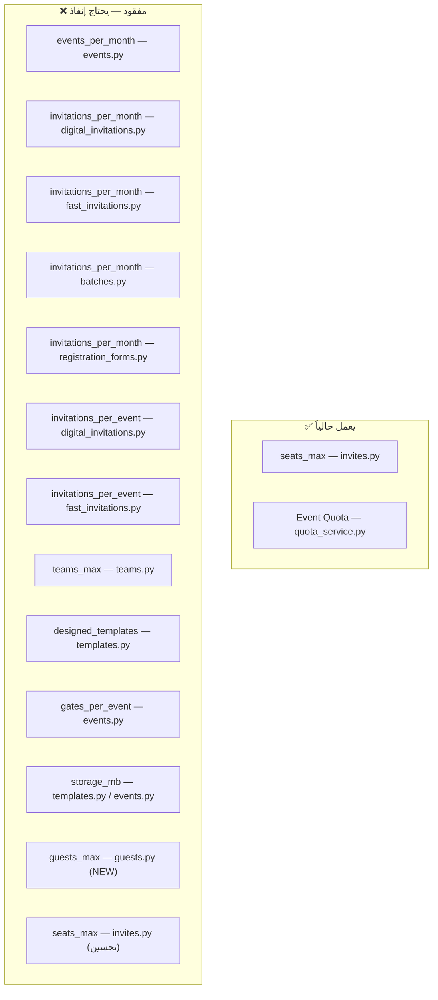

# إضافة حدود الباقات على كامل المنصة

## الهدف

تطبيق إنفاذ حدود الباقات (`plan_limits`) على **جميع** عمليات الإنشاء في المنصة. حالياً فقط `seats_max` مُطبّق في [invites.py](file:///d:/QR/app/routes/invites.py). بقية الموارد (أحداث، فرق، قوالب، بوابات، دعوات شهرية، ضيوف) **لا تملك أي حدود**.

## User Review Required

> [!IMPORTANT]
> **حدود جديدة مقترحة:** هل تريد إضافة حدود إضافية غير موجودة حالياً في `plan_limits`، مثل:
> - `guests_max` (حد أقصى للضيوف)
> - `registration_forms_max` (حد أقصى لنماذج التسجيل)
> - أو أي حد آخر؟

> [!WARNING]
> **Quota الحدث vs حدود الباقة:** حالياً يوجد نظامان:
> 1. **Event Quota** (`vip_quota`, `normal_quota` في جدول events) — يُطبَّق عبر [quota_service.py](file:///d:/QR/app/services/quota_service.py) ✅
> 2. **Plan Limits** (`plan_limits` في جدول plan_limits) — **غير مُطبَّق** ❌
>
> هذه الخطة تُضيف فقط إنفاذ Plan Limits. Event Quota يعمل بالفعل.

---

## التحليل الكامل: 13 نقطة إنفاذ مفقودة



---

## Proposed Changes

### المكون 1: خدمة الإنفاذ المركزية

#### [MODIFY] [feature_service.py](file:///d:/QR/app/services/feature_service.py)

إضافة دوال مساعدة جديدة لفحص الحدود مع العدد الحالي:

```python
# دالة جديدة: فحص حد شهري مع increment تلقائي
async def enforce_monthly_limit(
    db: AsyncSession,
    tenant_id: UUID,
    limit_key: str,
    resource_name: str,
    count: int = 1,
) -> None:
    """Check monthly usage counter against plan limit, increment if allowed."""
    from app.services.usage_service import check_and_increment
    # check_and_increment already raises 429 if exceeded
    await check_and_increment(db, tenant_id, limit_key, count)


# دالة جديدة: فحص حد ثابت (none period) بعدد COUNT من جدول
async def enforce_static_limit(
    db: AsyncSession,
    tenant_id: UUID,
    limit_key: str,
    current_count: int,
    resource_name: str,
    requested: int = 1,
) -> None:
    """Check a static (non-monthly) limit against current count."""
    limit_value = await get_plan_limit(db, tenant_id, limit_key)
    if limit_value == -1:
        return  # unlimited
    if current_count + requested > limit_value:
        raise HTTPException(
            status_code=status.HTTP_429_TOO_MANY_REQUESTS,
            detail=f"تم الوصول لحد {resource_name} ({limit_value}). "
                   f"الحالي: {current_count}, المطلوب: {requested}. قم بترقية خطتك.",
        )
```

---

### المكون 2: إنفاذ حد الأحداث الشهري

#### [MODIFY] [events.py](file:///d:/QR/app/routes/events.py)

**السطر 94-155** — `create_event()`: إضافة فحص `events_per_month` قبل INSERT

```diff
 async def create_event(...):
     tenant_id = get_tenant_id_from_header(request)
     await require_permission(db, tenant_id, user.id, "events.create")

+    # ── Plan limit: events_per_month ──
+    from app.services.feature_service import enforce_monthly_limit
+    await enforce_monthly_limit(db, tenant_id, "events_per_month", "الأحداث الشهرية")
+
     import re, secrets
     slug = re.sub(r'[^a-z0-9]+', '-', body.title.lower()).strip('-')
```

---

### المكون 3: إنفاذ حد البوابات لكل حدث

#### [MODIFY] [events.py](file:///d:/QR/app/routes/events.py)

**السطر 407-456** — `create_gate()`: إضافة فحص `gates_per_event`

```diff
 async def create_gate(...):
     tenant_id = get_tenant_id_from_header(request)
     await require_permission(db, tenant_id, user.id, "gates.manage")

+    # ── Plan limit: gates_per_event ──
+    from app.services.feature_service import enforce_static_limit
+    gates_count_res = await db.execute(
+        text("SELECT COUNT(*) FROM event_gates g JOIN events e ON e.id = g.event_id WHERE g.event_id = :eid AND e.tenant_id = :tid"),
+        {"eid": str(event_id), "tid": str(tenant_id)},
+    )
+    current_gates = gates_count_res.scalar() or 0
+    await enforce_static_limit(db, tenant_id, "gates_per_event", current_gates, "البوابات لكل حدث")
+
     result = await db.execute(
```

---

### المكون 4: إنفاذ حد الفرق

#### [MODIFY] [teams.py](file:///d:/QR/app/routes/teams.py)

**السطر 39-119** — `create_team()`: إضافة فحص `teams_max`

```diff
 async def create_team(...):
     tenant_id = get_tenant_id_from_header(request)
     await require_permission(db, tenant_id, user.id, "teams.manage")

+    # ── Plan limit: teams_max ──
+    from app.services.feature_service import enforce_static_limit
+    teams_count_res = await db.execute(
+        text("SELECT COUNT(*) FROM teams WHERE tenant_id = :tid"),
+        {"tid": str(tenant_id)},
+    )
+    current_teams = teams_count_res.scalar() or 0
+    await enforce_static_limit(db, tenant_id, "teams_max", current_teams, "الفرق")
+
     leader_id = body.leader_id or user.id
```

---

### المكون 5: إنفاذ حد القوالب المصممة

#### [MODIFY] [templates.py](file:///d:/QR/app/routes/templates.py)

**السطر 102-143** — `create_template()`: إضافة فحص `designed_templates` عند إنشاء قالب من نوع `designed`

```diff
 async def create_template(...):
     tenant_id = get_tenant_id_from_header(request)
     await require_permission(db, tenant_id, user.id, "templates.create")

+    # ── Plan limit: designed_templates (0 = disallowed in free) ──
+    if body.template_type == "designed":
+        from app.services.feature_service import enforce_static_limit
+        tmpl_count_res = await db.execute(
+            text("SELECT COUNT(*) FROM invite_templates WHERE tenant_id = :tid AND template_type = 'designed'"),
+            {"tid": str(tenant_id)},
+        )
+        current_templates = tmpl_count_res.scalar() or 0
+        await enforce_static_limit(db, tenant_id, "designed_templates", current_templates, "القوالب المصممة")
+
     result = await db.execute(
```

---

### المكون 6: إنفاذ حد الدعوات الشهري — Digital Invitations

#### [MODIFY] [digital_invitations.py](file:///d:/QR/app/routes/digital_invitations.py)

**3 نقاط إنفاذ:**

1. **`create_invitation()`** (سطر 95): إضافة فحص `invitations_per_month`
2. **`create_quick_invites()`** (سطر 163): إضافة فحص `invitations_per_month` 
3. **`create_bulk_from_guests()`** (سطر 271): إضافة فحص `invitations_per_month`

```diff
 # في كل دالة إنشاء دعوة:
+    from app.services.feature_service import enforce_monthly_limit
+    await enforce_monthly_limit(db, tenant_id, "invitations_per_month", "الدعوات الشهرية", count=total)
```

كذلك إضافة فحص `invitations_per_event` من `plan_limits` (بالإضافة للـ event quota الحالي):

```diff
+    from app.services.feature_service import enforce_static_limit
+    inv_count_res = await db.execute(
+        text("SELECT COUNT(*) FROM invitations WHERE event_id = :eid AND tenant_id = :tid AND status NOT IN ('revoked','expired')"),
+        {"eid": str(body.event_id), "tid": str(tenant_id)},
+    )
+    current_inv = inv_count_res.scalar() or 0
+    await enforce_static_limit(db, tenant_id, "invitations_per_event", current_inv, "الدعوات لكل حدث", requested=count)
```

---

### المكون 7: إنفاذ حد الدعوات الشهري — Fast Invitations

#### [MODIFY] [fast_invitations.py](file:///d:/QR/app/routes/fast_invitations.py)

**2 نقطتي إنفاذ:**

1. **`generate_invitations_fast_endpoint()`** (سطر 202)
2. **`generate_invitations_by_count()`** (سطر 337)

```diff
     await require_permission(db, tenant_id, user.id, "invitations.create")
+    # ── Plan limits ──
+    from app.services.feature_service import enforce_monthly_limit, enforce_static_limit
+    total = len(request.invitations)
+    await enforce_monthly_limit(db, tenant_id, "invitations_per_month", "الدعوات الشهرية", count=total)
+    # invitations_per_event check
+    inv_count_res = await db.execute(
+        text("SELECT COUNT(*) FROM invitations WHERE event_id = :eid AND tenant_id = :tid AND status NOT IN ('revoked','expired')"),
+        {"eid": str(request.event_id), "tid": str(tenant_id)},
+    )
+    current_inv = inv_count_res.scalar() or 0
+    await enforce_static_limit(db, tenant_id, "invitations_per_event", current_inv, "الدعوات لكل حدث", requested=total)
```

---

### المكون 8: إنفاذ حد الدعوات — Batches (Designed)

#### [MODIFY] [batches.py](file:///d:/QR/app/routes/batches.py)

**`generate_designed_fast()`** (سطر 550): إضافة نفس الفحوصات

```diff
     await require_permission(db, tenant_id, user.id, "batches.create")
+    from app.services.feature_service import enforce_monthly_limit, enforce_static_limit
+    total = len(body.invitations)
+    await enforce_monthly_limit(db, tenant_id, "invitations_per_month", "الدعوات الشهرية", count=total)
+    inv_count_res = await db.execute(...)
+    await enforce_static_limit(db, tenant_id, "invitations_per_event", current_inv, "الدعوات لكل حدث", requested=total)
```

---

### المكون 9: إنفاذ حد الدعوات — Registration Forms

#### [MODIFY] [registration_forms.py](file:///d:/QR/app/routes/registration_forms.py)

**`public_register()`** (سطر 285): إضافة فحص plan limits بعد event quota

```diff
     # 3. Check quota limit (event-level)
     await _check_quota(db, str(tenant_id), str(event_id), form_row["default_ticket_class"])
+
+    # 3b. Check plan limits (platform-level)
+    from app.services.feature_service import enforce_monthly_limit, enforce_static_limit
+    await enforce_monthly_limit(db, tenant_id, "invitations_per_month", "الدعوات الشهرية")
+    inv_count_res = await db.execute(
+        text("SELECT COUNT(*) FROM invitations WHERE event_id = :eid AND tenant_id = :tid AND status NOT IN ('revoked','expired')"),
+        {"eid": str(event_id), "tid": str(tenant_id)},
+    )
+    current_inv = inv_count_res.scalar() or 0
+    await enforce_static_limit(db, tenant_id, "invitations_per_event", current_inv, "الدعوات لكل حدث")
```

---

### المكون 10: إنفاذ حد الأعضاء — تحسين Invites

#### [MODIFY] [invites.py](file:///d:/QR/app/routes/invites.py)

**`create_invite()`** — تحسين الكود الحالي ليستخدم `feature_service` بدلاً من المنطق المكرر:

```diff
-    # Check seats limit
-    plan_code, limits = await get_tenant_plan_limits(db, tenant_id)
-    seats_limit = next((l["value"] for l in limits if l["key"] == "seats_max"), -1)
-    if seats_limit != -1:
-        current_seats = await get_seats_count(db, tenant_id)
-        pending_result = await db.execute(...)
-        pending_count = pending_result.scalar() or 0
-        if current_seats + pending_count >= seats_limit:
-            raise HTTPException(...)
+    # Check seats limit (centralized)
+    from app.services.feature_service import check_seats_limit
+    await check_seats_limit(db, tenant_id)
```

---

### المكون 11: إضافة حدود جديدة في Schema (اختياري)

#### [NEW] `migration_add_guests_limit.sql`

```sql
-- إضافة حد الضيوف (اختياري)
INSERT INTO public.plan_limits (plan_id, key, value, period) VALUES
    ((SELECT id FROM plans WHERE code = 'free'), 'guests_max', 100, 'none'),
    ((SELECT id FROM plans WHERE code = 'pro'), 'guests_max', 10000, 'none'),
    ((SELECT id FROM plans WHERE code = 'enterprise'), 'guests_max', -1, 'none')
ON CONFLICT (plan_id, key) DO NOTHING;
```

#### [MODIFY] [guests.py](file:///d:/QR/app/routes/guests.py)

```diff
 async def create_guest(...):
     tenant_id = get_tenant_id_from_header(request)
     await require_permission(db, tenant_id, user.id, "guests.create")
+
+    # ── Plan limit: guests_max (if defined) ──
+    from app.services.feature_service import get_plan_limit, enforce_static_limit
+    limit = await get_plan_limit(db, tenant_id, "guests_max")
+    if limit != -1:
+        count_res = await db.execute(
+            text("SELECT COUNT(*) FROM guests WHERE tenant_id = :tid"),
+            {"tid": str(tenant_id)},
+        )
+        await enforce_static_limit(db, tenant_id, "guests_max", count_res.scalar() or 0, "الضيوف")
```

وكذلك في `import_guests()`:

```diff
+    # Check guests_max limit for bulk import
+    limit = await get_plan_limit(db, tenant_id, "guests_max")
+    if limit != -1:
+        count_res = await db.execute(...)
+        current = count_res.scalar() or 0
+        await enforce_static_limit(db, tenant_id, "guests_max", current, "الضيوف", requested=len(body.guests))
```

---

## ملخص نقاط الإنفاذ

| # | الملف | الدالة | المفتاح | النوع |
|---|-------|--------|---------|-------|
| 1 | events.py | `create_event` | `events_per_month` | شهري |
| 2 | events.py | `create_gate` | `gates_per_event` | ثابت |
| 3 | teams.py | `create_team` | `teams_max` | ثابت |
| 4 | templates.py | `create_template` | `designed_templates` | ثابت |
| 5 | digital_invitations.py | `create_invitation` | `invitations_per_month` + `invitations_per_event` | شهري + ثابت |
| 6 | digital_invitations.py | `create_quick_invites` | `invitations_per_month` + `invitations_per_event` | شهري + ثابت |
| 7 | digital_invitations.py | `create_bulk_from_guests` | `invitations_per_month` + `invitations_per_event` | شهري + ثابت |
| 8 | fast_invitations.py | `generate_invitations_fast_endpoint` | `invitations_per_month` + `invitations_per_event` | شهري + ثابت |
| 9 | fast_invitations.py | `generate_invitations_by_count` | `invitations_per_month` + `invitations_per_event` | شهري + ثابت |
| 10 | batches.py | `generate_designed_fast` | `invitations_per_month` + `invitations_per_event` | شهري + ثابت |
| 11 | registration_forms.py | `public_register` | `invitations_per_month` + `invitations_per_event` | شهري + ثابت |
| 12 | invites.py | `create_invite` | `seats_max` | ثابت (تحسين) |
| 13 | guests.py | `create_guest` + `import_guests` | `guests_max` | ثابت (جديد) |

---

## Verification Plan

### Automated Tests

```bash
# 1. التحقق من أن feature_service يعمل
cd d:\QR
python -c "from app.services.feature_service import enforce_monthly_limit, enforce_static_limit; print('✅ Imports OK')"

# 2. التحقق من أن جميع الملفات المعدلة لا تحتوي أخطاء syntax
python -m py_compile app/routes/events.py
python -m py_compile app/routes/teams.py
python -m py_compile app/routes/templates.py
python -m py_compile app/routes/digital_invitations.py
python -m py_compile app/routes/fast_invitations.py
python -m py_compile app/routes/batches.py
python -m py_compile app/routes/registration_forms.py
python -m py_compile app/routes/invites.py
python -m py_compile app/routes/guests.py
python -m py_compile app/services/feature_service.py

# 3. تشغيل السيرفر والتحقق
uvicorn app.main:app --host 0.0.0.0 --port 8000
```

### Manual Verification
- إنشاء tenant بباقة Free ثم محاولة إنشاء أكثر من حدث واحد → يجب أن يرفض
- إنشاء أكثر من فريق واحد بباقة Free → يجب أن يرفض
- إنشاء قالب مصمم بباقة Free → يجب أن يرفض (designed_templates = 0)
- إنشاء أكثر من 50 دعوة شهرياً بباقة Free → يجب أن يرفض
